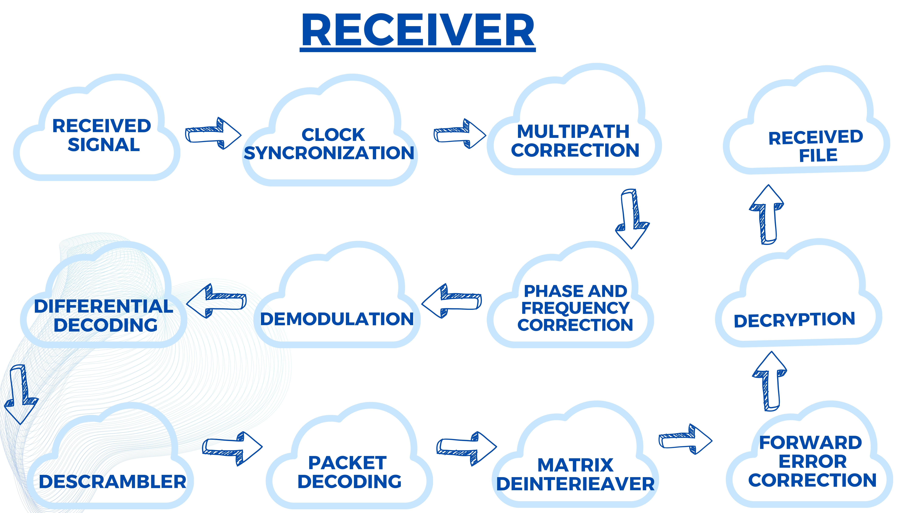

# Basic Wireless Communication System

This repository contains the project details for the **"Basic Wireless Communication System"**, completed as part of the Semester 3 EN2130 Communication Design Project module. The project involves the design and implementation of a point-to-point digital wireless communication system using software-defined radios (SDRs).

## Project Overview

The wireless communication system utilizes:

- **Transmitter**: BladeRF 2.0 micro xA9
- **Receiver**: RTL-SDR

### Project Goals
The goal of the project was to transmit the following data types:
- Binary stream
- Image file
- Audio file

### Achievements
We successfully transmitted and received the **image** and **audio** files with high accuracy. The image and audio were processed and transmitted without significant issues, demonstrating the functionality of the system.

### Challenges
However, due to some technical difficulties, we were not able to correctly receive the transmitted **binary stream**. Despite this challenge, the project provided valuable insights into the complexities of SDRs and wireless communication.

## Key Features
- Point-to-point communication using SDR technology
- Successful transmission of image and audio files
- Hands-on experience with BladeRF 2.0 micro xA9 and RTL-SDR
- Usage of Octave, Pyton and GNU Radio

## Software Used
- **Python**: Used for encryption purposes, ensuring the security of the transmitted data.
- **Octave**: Used for packetization, allowing data to be properly formatted for transmission.
- **GNU Radio**: Used for signal processing and transmission of the data through the wireless communication system.

## Architecture
### Transmitter Design

  

### Receiver Design

  

### Monochrome Image Transmission

  
  

### Binary Data Stream Transmission

  
  

### Audio Transmission

  
  

## Google Drive Link
[Results and Source Files](https://drive.google.com/drive/folders/1iKESfcS8wrHWPmJ01y9LUf-dAP9Ict9p)

## Conclusion
This project helped us apply communication and signal processing concepts in real-world systems. It also gave us hands-on experience with SDR technology, and we learned a lot about troubleshooting and improving system reliability.
